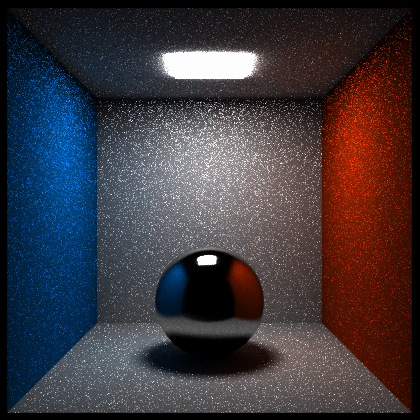
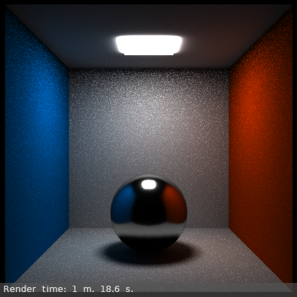

## What is it

This is another basic raytracer, written in [AssemblyScript](https://www.assemblyscript.org/) ad compiled into [WebAssembly](https://webassembly.org/) module. Raytracer is based on [Ray Tracing in One Weekend](https://raytracing.github.io/) book series. It contains the following additional features:
* Render triangulated polygon meshes
* Distance light and point light sources
* Allows not only to render the image, but also to bake lightmaps. It can bake full lightmaps or indirect lighting only.

The module compiled as independent calculation module without WASI. So, the renderer can not save output images to the disc and load textures from it. You should save pixels data of an output images yourself. If you would like to use any texture, then you should read it yourself and pass to the renderer only array of the texture pixels colors.

## How to build

The main source file is ```renderer.ts```. To compile it you should also select additional files: ```aarect.ts```, ```box.ts```, ```camera.ts```, ```color.ts```, ```light.ts```, ```material.ts```, ```sphere.ts```, ```texture.ts```, ```utilities.ts``` and ```vec3.ts```.

So, the example of the build command is the following:

```
asc assembly/renderer.ts assembly/aarect.ts assembly/box.ts assembly/camera.ts assembly/color.ts assembly/light.ts assembly/material.ts assembly/sphere.ts assembly/texture.ts assembly/utilities.ts assembly/vec3.ts -o build/renderer.wasm --exportRuntime -Ospeed --noAssert --optimizeLevel 3
```

## How to use

Step 0. Import wasm module into your environment as usual. You can use standard AssemblyScript [loader](https://www.assemblyscript.org/loader.html) for Node.js or browser, or use may be something more specific. For example [pyaswasm](https://github.com/Tugcga/pyaswasm) for Python with [Wasmer](https://github.com/wasmerio/wasmer-python) backend. For importing you should define five external functions

```
function finish_prepare(): void;
function start_render(): void;
function finish_render(): void;
function render_process(row: i32, scanline: Float64Array): void;
```

These functions called by the module for notification during the render process. The most important is ```render_process```. It output from the module pixels for new rendered line as plane float array. Image lines rendered from top to bottom.

So, assume we load the module with all exports as ```module``` variable.

Step 1. Create render instance

```
let render_ptr = module.__pin(module.create_renderer());
let render = module.renderer.wrap(render_ptr);
```

Step 2. Setup camera and output image resolution (look to the API section for signature of an each method)

```
render.set_camera(-10.0, 8.0, 0.0, -2.0, 1.0, 0.0, 30.0, 0.0);
render.set_image_size(640, 480);
```

Step 3. Create materials, objects, lights and add it to the renderer. For example, to create simple white diffuse material

```
let white_mat = module.__pin(module.create_lambertian_material(module.create_sold_color(1.0, 1.0, 1.0)));
```

To add the sphere primitive with this material to the scene

```
render.add_sphere(0.0, 1.5, 0.0, 1.5, white_mat, false);
```

Coordinate system in the scene is the following: X-axis directed to the right, Y-axis directed to the top and the direction of the Z-axis define right coordinate system.

Step 4. Render the image

```
render.render(256, 10);
```

or bake the lightmap

```
render.bake(256, 10, false);
```

Step 5. Get array with values of the output image pixels

```
let pixels_ptr = module.__pin(render.get_render_buffer(true));
let pixels = module.__getArray(pixels_ptr);
```

The method ```get_render_buffer``` return plain float array. Each pixel contains three channels (R, G and B), so the length of the array is ```width * height * 3```. You can convert float values of the array to actual RGB-colors by using

```
let pixels_int_ptr = module.__pin(module.float_colors_to_int8_colors(pixels_ptr));
let pixels_int = module.__getArray(pixels_int_ptr);
```

Step 6. Save output image pixels to the image by yourself. You can use any additional external library, for example [pngjs](https://github.com/lukeapage/pngjs) for Node.js.

Step 7. Unpin all pointers.

## API

### Static module functions

```create_renderer(): renderer```

Create and return pointer to the render object instance.


```create_vector(x: f64, y: f64, z: f64): vec3```

Create 3d-vector from 3 float values.


```float_colors_to_int8_colors(array: Float64Array): Int32Array```

Convert float color values from the array to integer color values. In fact each element is multiplied to 255.


```create_sold_color(r: f64, g: f64, b: f64): solid_color```

Create texture object with one specific color (defined by input parameters). This texture is called ```solid texture```


```create_checker_texture(color_01: texture, color_02: texture, squares_u: f64, squares_v: f64, squares_w: f64): checker_texture```

Create spatial checker texture. Two input textures used for even and odd squares of the texture. Use solid color textures to define colors of squares. ```squares_u```, ```squares_v``` and ```squares_w``` are the number of squares along x, y and z directions in 1 unit.


```create_checker_2d_texture(color_01: texture, color_02: texture, squares_u: f64, squares_v: f64): checker_texture_2d```

Create 2d checker texture. ```squares_u``` and ```squares_v``` are number of squares in [0; 1] of uv-coordinates.


```create_noise_texture(color_01: texture, color_02: texture, scale_u: f64, scale_v: f64, scale_w: f64): noise_texture```

Create spatial noise texture.


```create_noise_2d_texture(color_01: texture, color_02: texture, scale_u: f64, scale_v: f64, scale_w: f64, z_slice: f64): noise_texture_2d```

Create 2d noise texture. Parameter ```z_slice``` define the spatial slice of the texture.


```create_gradient_texture(color_01: vec3, color_02: vec3): gradient_texture```

Create gradient texture. ```color_01``` at the bottom level, ```color_02``` at the top level in the uv-square.


```create_uv_texture(): uv_texture```

Create texture, which output uv-coordinates of the object. U-coordinate writes to the r-channel, v-coordinate to the g-channel, b-channel is always zero.


```create_image_texture(pixels: Uint8Array, width: i32, height: i32): image_texture```

Create image texture from input pixels data. This array should be plain array with colors of the image. The first 3 or 4 values are channel of the first pixel, then of the second and so on.


```create_image_hdr_texture(pixels: Float64Array, width: i32, height: i32): image_texture_hdr```

The same as previous, but encode hdr-texture by float values.


```create_lambertian_material(albedo: texture): lambertian```

Create simple diffuse material. Albedo should be a texture. For simple clor use solid color texture.


```create_metal_material(albedo: texture, roughness: texture): metal```

Create simple metal material. Roughness = 0.0 corresponds to clear reflections, 1.0 to fully blurred reflections.


```create_glass_material(ior: f64): dielectric```

Create simple glass material. The glass is always clear without any absorption.


```create_emission_material(albedo: texture): diffuse_light```

Create emission material. Albedo defines an emission color.


```create_combined_material(albedo: texture, roughness: texture, emission: texture, emission_mask: texture, metal_mask: texture): simple_combined```

Combined material combine diffuse material, metal and emission. It mixed by masks. Emission at the top, metal is a middle layer and diffuse is a bottom layer.


### Renderer class methods

```set_bake_padding(value: f64): void```

Define padding in the texture for baking process. Measured in relative uv-values (from 0.0 to 1.0). 


```get_bake_padding(): f64```

Return the current baking padding.


```get_aspect_ratio(): f64```

Return the output image aspect ratio. It equals width / height.


```get_fov(): f64```

Return the vertical fov (field of view) of the current camera.


```get_aperture(): f64```

Return aperture of the current camera. Non-zero values used for simulating dof-effect (depth of field).


```set_image_size(width: i32, height: i32): void```

Set output image resolution.


```get_image_size(): Int32Array```

Return output image resolution as two-elements array.


```set_camera(from_x: f64, from_y: f64, from_z: f64, to_x: f64, to_y: f64, to_z: f64, fov: f64, aperture: f64): void```

Define camera for the rendering. Values ```from_x```, ```from_y``` and ```from_z``` define position of the camera, ```to_x```, ```to_y``` and ```to_z``` - interest position of the camera (and focus distance), ```fov``` - vertical field of view, ```aperture``` - amount of the dof-effect.


```set_background(back_texture: texture): void```

Define background texture. Background use spherical coordinates.


```add_point_light(x: f64, y: f64, z: f64, r: f64, g: f64, b: f64): void```

Add point light to the scene. ```x```, ```y``` and ```z``` define it position, ```r```, ```g```, and ```b``` - color of the light.


```add_directional_light(x: f64, y: f64, z: f64, dir_x: f64, dir_y: f64, dir_z: f64, r: f64, g: f64, b: f64): void```

Add directional light to the scene. ```x```, ```y``` and ```z``` define it position, ```dir_x```, ```dir_y``` and ```dir_z``` - direction (not necessary unit vector), ```r```, ```g```, and ```b``` - color of the light.


```add_sphere(center_x: f64, center_y: f64, center_z: f64, radius: f64, material: material, is_attractor: bool): void```

Add sphere primitive to the scene. ```center_x```, ```center_y``` and ```center_z``` define center of the sphere, ```radius``` - radius of the sphere, ```material``` - material. If ```is_attractor = true```, then this object will be used to define additional samples during render process. By default this values should be ```false```, but if the object used as light source, then it should be ```true```.


```add_x_plane(min_y: f64, min_z: f64, max_y: f64, max_z: f64, x: f64, material: material, is_attractor: bool): void```

Add plane perpendicular to the x-direction. It span points ```(x, min_y, min_z)``` and ```(x, max_y, max_z)```.


```add_y_plane(min_x: f64, min_z: f64, max_x: f64, max_z: f64, y: f64, material: material, is_attractor: bool): void```

Add plane perpendicular to the y-direction. It span points ```(min_x, y, min_z)``` and ```(max_x, y, max_z)```.


```add_z_plane(min_x: f64, min_y: f64, max_x: f64, max_y: f64, z: f64, material: material, is_attractor: bool): void```

Add plane perpendicular to the z-direction. It span points ```(min_x, min_y, z)``` and ```(max_x, max_y, z)```.


```add_cube(min_x: f64, min_y: f64, min_z: f64, max_x: f64, max_y: f64, max_z: f64, material: material, is_attractor: bool): void```

Add cube to the scene. The cube span points ```(min_x, min_y, min_z)``` and ```(max_x, max_y, max_z)```.


```add_polygonmesh(vertices: Float64Array, normals: Float64Array, uvs: Float64Array, material: material, culling: bool, is_attractor: bool, is_bake: bool, uvs_second: Float64Array): void```

Add triangulated mesh to the scene. ```vertices``` is a plane array of vertex positions. The first three values is the position of the first vertex of the first triangle, the second triple of values define position of the second vertex of the first triangle and so on. After the coordinates of the first triangle the array contains positions of vertices of the second triangle and so on. So, the length of the array is ```9 * triangles_count```. The front face of the triangle defined by counterclock-wise direction of the point sequence.

Array ```normals``` can be empty. In this case each triangle will use local normal (this called flat shading in the Blender). Or you can set specific normal to each vertex of each triangle. In this case the array should be the same length as ```vertices``` array (three coordinates per point, hence nine coordinates per triangle). 

Array ```uvs``` may be empty. In other case it should contains two values for each vertex. 

If ```culling``` is ```false```, then object will be rendered as two-sided. 

If ```is_bake = true``` then triangles of the object will be used for baking process. In this case it will be use ```uvs_second``` coordinates of baking uvs.


```render(samples: i32, bounds: i32): void```

Start render process. ```samples``` define the quality of the output image (more samples - more quality and longer render time). ```bounds``` define how many ray collisions should be used for calculating lighting.


```bake(samples: i32, bounds: i32, ignore_direct_lighting: bool): void```

Start baking process for all polygonal objects, marked as baked object (with ```is_bake = true```). If ```ignore_direct_lighting = false``` then it will bake full lights information. If ```ignore_direct_lighting = true``` then it will save to the output image only indirect contribution. The full lighting calculated in the following way: ```direct lighting``` + ```indirect``` * ```albedo```. Direct lighting can be baked by setting ```bounds = 0```.

```get_render_buffer(is_linear: bool): Float64Array```

Return pixels data of the output image as plane float array. The renderer does not save alpha-channel, so the length of the array is ```width * height * 3```. If ```is_linear = true``` then it will return colors in linear space, if ```is_linear = false``` then it will return colors with sRGB gamma correction.


## Performance

The renderer is quite slow. At least with respect to productions ready renderer like [Cycles](https://www.cycles-renderer.org/) or [Arnold](https://www.arnoldrenderer.com/). There are several reasons:
* AssemblyScript is cool, but it produce not the most performance code. [Emscripten](https://emscripten.org/) is slightly faster in the same source code. But one of the main advantage of the AssemblyScript is very tiny size of the output wasm module.
* WebAssembly works slowly with respect to native code. The speed also depends on host environment. Wasmtime, for example, slowly than Node.js.
* AssemblyScript applications are single-threaded. There are some low-level multi-thread functions, but I can not understand how to use it.
* Renderer is based on the tutorial. Serious renderers use more advanced algorithms, and hence works faster.
* Out implementation written in OOP style. During rendering process it creates and destroy many temporary objects. This also leads to the low speed.

For testing we use two different scenes with corner box. The first corner box contains environment light and one directional light. The other corner box contains rectangular mesh light. We render these scenes in Cycles and in out renderer. In Cycles we use only one core for rendering. Result images and render times are in tables. As a result, the renderer is x10 times slowly at the first scene and x7 times slowly at the second. At the first scene the results are close, but at the second our renderer produce more noisy result with the same count of samples.

### Corner box with distance light

The code for scene construction

```
let render_ptr = module.__pin(module.create_renderer());
let render = module.renderer.wrap(render_ptr);
render.set_camera(0.0, 4.0, 13.0, 0.0, 4.0, 0.0, 45.0, 0.0);

let white_mat = module.__pin(module.create_lambertian_material(module.create_sold_color(1.0, 1.0, 1.0)));
let green_mat = module.__pin(module.create_lambertian_material(module.create_sold_color(0.122, 1.0, 0.0)));
let red_mat = module.__pin(module.create_lambertian_material(module.create_sold_color(1.0, 0.059, 0.0)));

render.add_y_plane(-4.0, -4.0, 4.0, 4.0, 0.0, white_mat, false);
render.add_y_plane(-4.0, -4.0, 4.0, 4.0, 8.0, white_mat, false);
render.add_z_plane(-4.0, 0.0, 4.0, 8.0, -4.0, white_mat, false);
render.add_x_plane(0.0, -4.0, 8.0, 4.0, -4.0, green_mat, false);
render.add_x_plane(0.0, -4.0, 8.0, 4.0, 4.0, red_mat, false);

let metal_mat = module.__pin(module.create_metal_material(module.create_sold_color(1.0, 1.0, 1.0), module.create_sold_color(0.3, 0.3, 0.3)));
render.add_sphere(0.0, 1.5, 0.0, 1.5, metal_mat, false);

const light_intensity = 1.125;
render.add_directional_light(5.0, 5.0, 5.0, -3.5, -5.0, -3.5, light_intensity, light_intensity, light_intensity);
let bg_color = module.__pin(module.create_sold_color(0.557, 0.741, 1.0));
render.set_background(bg_color);

render.set_image_size(420, 420);
var time = performance.now();
const samples = 512;
render.render(samples, 6);
```

| Samples | AsTracer | Cycles | Slow prop. |
| :---: | :---: | :---: | :---: | 
| 1 | <br>4.59 sec | <br>0.59 sec | 7.7
| 10 | <br>45.61 sec | <br>4.9 sec | 9.3
| 64 | <br>4 min 56 sec | <br>29.5 sec | 10.3
| 128 | <br>10 min 6 sec | <br>57.9 sec | 10.4
| 256 | <br>20 min 9 sec | <br>1 min 58 sec | 10.2
| 512 | <br>40 min 14 sec | <br>3 min 59 sec | 10.1

### Corner box with rectangular mesh light

The code for scene construction

```
let render_ptr = module.__pin(module.create_renderer());
let render = module.renderer.wrap(render_ptr);
render.set_camera(0.0, 4.0, 14.0, 0.0, 4.0, 0.0, 45.0, 0.0);

let white_mat = module.__pin(module.create_lambertian_material(module.create_sold_color(1.0, 1.0, 1.0)));
let blue_mat = module.__pin(module.create_lambertian_material(module.create_sold_color(0.0, 0.518, 1.0)));
let red_mat = module.__pin(module.create_lambertian_material(module.create_sold_color(1.0, 0.227, 0.0)));

render.add_y_plane(-4.0, -4.0, 4.0, 4.0, 0.0, white_mat, false);
render.add_y_plane(-4.0, -4.0, 4.0, 4.0, 8.0, white_mat, false);
render.add_z_plane(-4.0, 0.0, 4.0, 8.0, -4.0, white_mat, false);
render.add_x_plane(0.0, -4.0, 8.0, 4.0, -4.0, blue_mat, false);
render.add_x_plane(0.0, -4.0, 8.0, 4.0, 4.0, red_mat, false);

let metal_mat = module.__pin(module.create_metal_material(module.create_sold_color(1.0, 1.0, 1.0), module.create_sold_color(0.2, 0.2, 0.2)));
render.add_sphere(0.0, 1.5, 0.0, 1.5, metal_mat, false);

let emission_mat = module.__pin(module.create_emission_material(module.create_sold_color(20.0, 20.0, 20.0)));
render.add_y_plane(-1.0, -1.0, 1.0, 1.0, 7.9, emission_mat, true);

render.set_image_size(420, 420);
render.render(512, 2);
```

| Samples | AsTracer | Cycles | Slow prop. |
| :---: | :---: | :---: | :---: | 
| 1 | <br>1.92 sec | <br>0.58 sec | 3.3
| 10 | <br>19.13 sec | <br>3.28 sec | 5.8
| 64 | <br>2 min 3 sec | <br>19.2 sec | 6.4
| 128 | <br>4 min 16 sec | <br>38.1 sec | 6.7
| 256 | <br>8 min 12 sec | <br>1 min 18 sec | 6.3
| 512 | <br>16 min 24 sec | <br>2 min 36 sec | 6.3